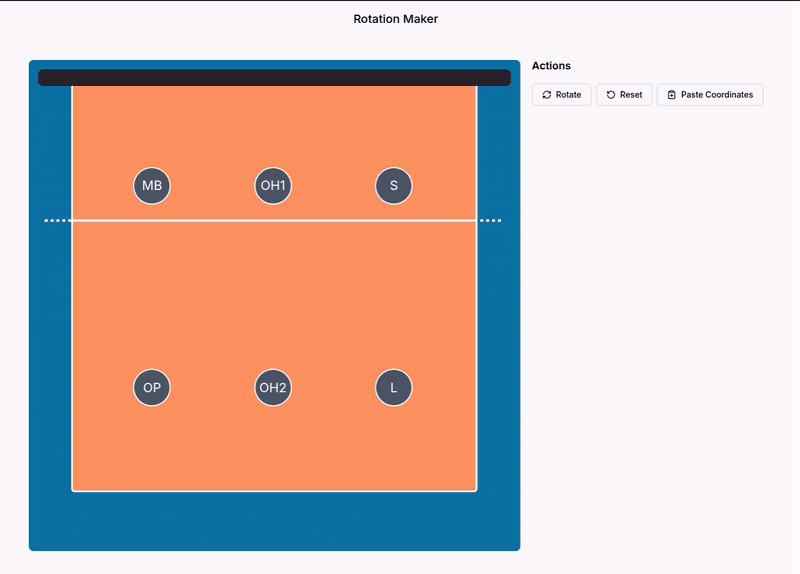

### Rotation Maker

A personal tool for positioning volleyball players on a court and exporting their X,Y coordinates as JSON.

 

 

#### About

My next project is a learning tool for beginner volleyball players focused on rotations within the game. The idea is to use CSS scroll animations to show player movement on a court, helping beginners visualise positioning. Since I need X and Y percentage values to place player icons absolutely, I built this tool to make capturing those coordinates straightforward.

 

#### Features

- Drag and drop of player icons around a volleyball court
  - Implemented with pointer events api so both mouse and touch work.
- Rotate the players through all 6 court positions
- Snapshot the current coordinates of all players and copy them as formatted JSON
- Reset players back to the base position of the current rotation.

 

#### Built With

- Next.js 15
- TypeScript
- Tailwind CSS

 

> **Note:** Accessibility has been intentionally ignored — this is a personal tool built for my own use.

 

---

Built by <a href="https://www.joshgretton.co.uk">Josh Gretton</a>

